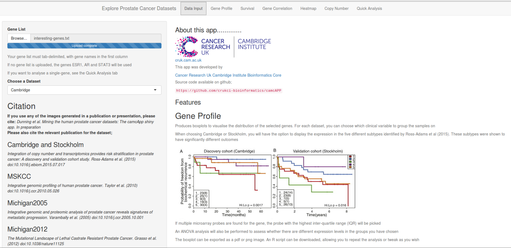
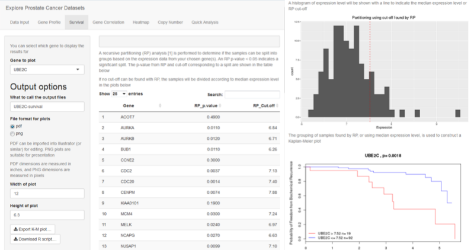
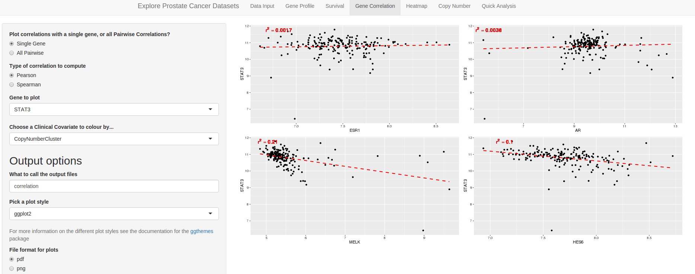
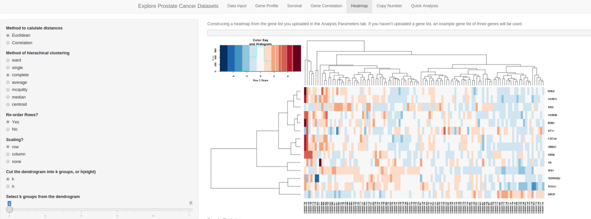
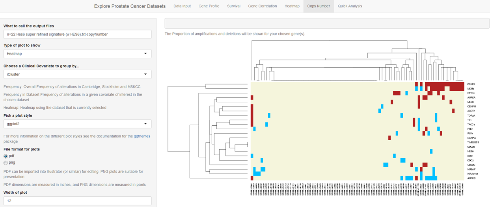

```{r setup, include=FALSE}
knitr::opts_chunk$set(echo = TRUE)
```

# Introduction

The camcAPP is implemented as a Shiny application [@shiny] in R. Shiny allows the non-specialist Bioinformatician to create publication-ready figures and tables through an intuitive online interface to the underlying R code. 


# Details of specific panels and functionality


## Data Input Panel

There are two tasks to complete in the Data Input panel: Specification of a set of genes to study, and specification of the data set in which to study them (expression analyses only). The data set is specified via the *Choose a Dataset* drop down menu in the obvious manner.



### Uploading a gene list for interrogation

The gene-list must be presented in a tab-delimited file assumed to have a column header. Only one column is required in the file, and this must contain the offical RefSeq gene symbols that are to be used in analysis. Each gene symbol must appear on a different row. If no list is uploaded, a sample list of illustrative cancer-related genes is used; AR, ESR1, HES6, MELK and STAT3. See **Figure 1**.


## Gene Profile

In this panel one can produce boxplots of the expression levels of the chosen gene list across a particular study. A clinical covariate is used to split the samples into different groups (choice of covariates will depend on dataset).  The default settings will show the Cambridge gene-expression stratified by the subgroups identified in [@Ross-Adams] (**Figure 2**). 

![Boxplots for gene expression can be created for a list of genes. This example shows the expression profile of selected genes in the five subgroups identified in the analysis of [@Ross-Adams].](Figure2.png)

One can choose to tile images for all genes at once in a grid-like display. By clicking *Composite plot?* to *No* you can view a particular gene, where the gene to be plotted is given in the *Gene to Plot* dropdown box.

The z-score transformation will scale all genes to an average expression level of $0$ and standard deviation of $1$; thus making it easier to compare the trends of different genes. 

An analysis of variance is also performed for each gene to see if there is evidence for a change in expression level across the different categories for selected covariate. 

## Survival

The `party` R package [@party] is first used on a gene-by-gene basis to see if the samples can be partitioned into (typically, two) groups with distinct (p-value of $<0.05$) survival profiles based on the expression levels. If no signficant partitioning is identified, samples are assigned to low or high expression level groups based on the median expression level of the gene. 




The histogram (**Figure 3. Top Right**) shows the distribution of expression levels for a chosen gene (defined by the *Gene to plot* drop-down) and vertical line to show the cut-off to be used to assign samples to groups (either median expression level, or the cut-off identified by recursive partitioning)

A Kaplan-Meier curve is then generated from the biochemical relapse-free times of samples in the different groups (**Figure 3. Bottom Right**).

Note only the Cambridge 2015, Stockholm and MSKCC dataset include the appropriate clinical metadata to perform a survival analysis.

## Gene Correlation

This panel can display scatter plots for all pairwise combinations of genes in the selected list. Points in the scatter plots can be coloured according to the different clinical covariates in the selected study.



Alternatively, a single gene can be selected from the gene list and the panel will be display a series of scatter plots with the expression level of the selected gene on the y-axis, and each other gene in the x-axis. These scatter plots will also show the value of $r^2$ using either Pearson or Spearman correlation (**Figure 4**).


## Heatmap

The entire gene-list is used to cluster the samples in the chosen study, and the resulting ordering of samples is displayed using a heatmap (**Figure 5**). Cells in the heatmaps are coloured blue for under-expressed genes and red for over-expressed. The default option generate a heatmap by computing Euclidean distances and applying hierachical clustering with complete linkage. However, other popular methods (e.g. correlation-based distance) are supported. Furthermore, the rows of the heatmap (i.e. the genes in the gene-list) can be ordered according to the results of the clustering, or left in the order in which they occur in the gene-list (option *Re-order Rows?*).



We also include some basic exploratory analysis of the sample clustering. The dendrogram of the samples can be "cut" at a specified height, $h$,  (on the y-axis), or an unknown height that will yield a pre-determined number of clusters, $k$. The clinical characteristics of the samples that fall into each cluster are then tabulated. Note that the values of $h$ and $k$ are restricted to give between 2 and 10 clusters. 

## Copy Number

This panel allows the visualisation of copy-number calls from Cambridge 2015, Stockholm and MSKCC datasets. The processing of these datasets has been previously described [@CopyNumber]. Firstly (*Frequency* option in the *Type of plot to show* drop-down menu ), one can see, on a per-gene basis the percentage of samples in each of the cohorts that have an amplification or deletion of the given gene. Alternatively (*Frequency by Dataset* option in *Type of plot to show*), for a selected cohort, the number of samples may be split into different clinical subgroups and the number of per-gene deletions and amplifcations for each subgroup can be tabulated.



Finally (the *Heatmap* option in *Type of plot to show*), a heatmap can be generated from the copy-number calls of all selected genes in the selected cohort. Thus, allowing the user to assess whether certain genes are amplified or deleted in the same samples (**Figure 6**).

## Quick Analysis

This panel allows the boxplots, survival and copy-number analysis listed above to be performed on a single-gene rather than a gene list. The gene name must be entered into the text box, and the user can check whether the name entered is a valid gene name before clicking *Go!* to proceed with the analysis.


\newpage

# Implementation 

The source code for camcAPP is available through github [@github-repo]. The `dplyr` [@dplyr] package is used throughout for efficient data manipulation and graphics are generated using `ggplot2` [@ggplot2]. Plots can be exported as PDF or PNG file with configurable height, width and file name. Some configuration of the background colour and grid style is also possible with the *Pick a plot style* drop-down box, which changes the overall appearance of the plot using pre-defined themes in `ggplot2` and the `ggthemes` package [@ggthemes].


# Data Availability

Each dataset that can be interrogated using camcAPP has previously been made available through Gene Expression Omnibus (GEO). Using the GEOquery [@GEOquery] Bioconductor package, each dataset was downloaded and converted into a data object (`ExpressionSet`) compatible with Bioconductor [@BioC] packages. Thus, each dataset is also available as a Bioconductor experimental data package and can be downloaded and interrogated independantly of camcAPP. The R code used to download and process each dataset is available in its respective package vignette. Below is the R code required to download the data package for the Cambridge 2015 dataset. Datasets other than Cambridge 2015 can be installed by replacing `prostateCancerCamcap` with the appropriate package name. GEO accession numbers and corresponding Bioconductor package names are given in Table 1. 

## Example of installing the prostateCancerCamcap data package in R
```{r eval=FALSE}
source("http://www.bioconductor.org/biocLite.R")
biocLite("prostateCancerCamcap")
```


Dataset  | GEO Accession | Bioconductor Package
------------- | -------------|-------------------
Cambridge 2015    | GSE70770 | prostateCancerCamcap
Stockholm 2015    | GSE70769 | prostateCancerStockholm
MSKCC 2010        | GSE21032 | prostateCancerTaylor
Michigan 2012     | GSE35988 | prostateCancerGrasso
Michigan 2005     | GSE3325  | prostateCancerVarambally

Table: Summary of each dataset accessible through camcAPP, its GEO accession number and Bioconductor data package


## Reproducible analyses using docker

Docker is a system that facilitates easy deployment and sharing of software as containers to alleviate the common headache of "dependancy hell" when trying to install Bioinformatics software [@Boettiger:2015:IDR:2723872.2723882]. We provide a docker container for those that want easy access to all the R code, packages and datasets used in the app. The latest version of Docker is available for Windows 10 and Mac OSX 10.11 or newer. Once Docker is install, the container to run camcAPP can be installed and run from a terminal window as follows.

```{bash eval=FALSE}
docker pull markdunning/camcapp
docker run -p 8787:8787 markdunning/camcapp
```

Entering the address: `http://localhost:8787` in a web-browser will then open an RStudio session with the username and password `rstudio`. Running the following commands in the RStudio console will run the app.

```{r eval=FALSE}
library(shiny)
runApp("../camcAPP")
```


# References
